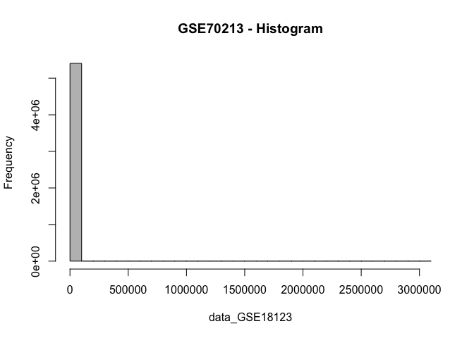
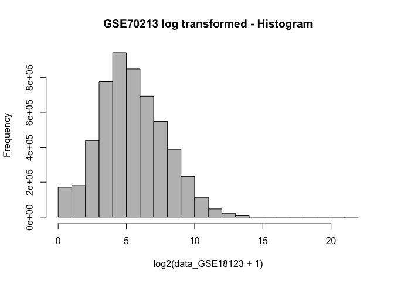
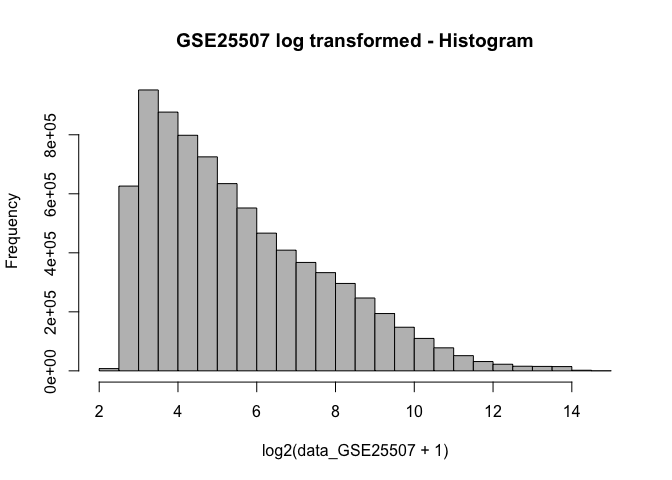
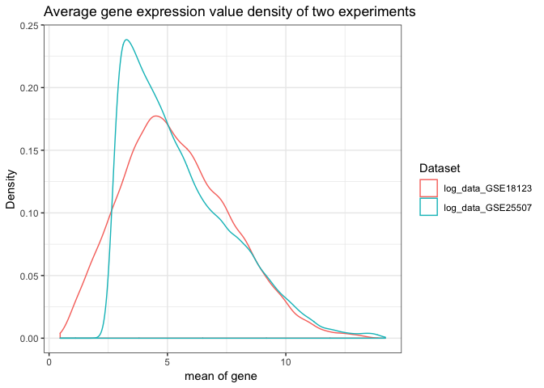

Pre processing
================
Yanchao
2019-03-25

Load the library
----------------

``` r
library(RColorBrewer)
library(cluster)
library(pvclust)
library(xtable)
library(limma)
library(plyr)
library(lattice)
library(RCurl)
```

    ## Loading required package: bitops

``` r
options(download.file.method = "curl")
library(GEOquery)
```

    ## Loading required package: Biobase

    ## Loading required package: BiocGenerics

    ## Loading required package: parallel

    ## 
    ## Attaching package: 'BiocGenerics'

    ## The following objects are masked from 'package:parallel':
    ## 
    ##     clusterApply, clusterApplyLB, clusterCall, clusterEvalQ,
    ##     clusterExport, clusterMap, parApply, parCapply, parLapply,
    ##     parLapplyLB, parRapply, parSapply, parSapplyLB

    ## The following object is masked from 'package:limma':
    ## 
    ##     plotMA

    ## The following objects are masked from 'package:stats':
    ## 
    ##     IQR, mad, sd, var, xtabs

    ## The following objects are masked from 'package:base':
    ## 
    ##     anyDuplicated, append, as.data.frame, basename, cbind,
    ##     colMeans, colnames, colSums, dirname, do.call, duplicated,
    ##     eval, evalq, Filter, Find, get, grep, grepl, intersect,
    ##     is.unsorted, lapply, lengths, Map, mapply, match, mget, order,
    ##     paste, pmax, pmax.int, pmin, pmin.int, Position, rank, rbind,
    ##     Reduce, rowMeans, rownames, rowSums, sapply, setdiff, sort,
    ##     table, tapply, union, unique, unsplit, which, which.max,
    ##     which.min

    ## Welcome to Bioconductor
    ## 
    ##     Vignettes contain introductory material; view with
    ##     'browseVignettes()'. To cite Bioconductor, see
    ##     'citation("Biobase")', and for packages 'citation("pkgname")'.

    ## Setting options('download.file.method.GEOquery'='auto')

    ## Setting options('GEOquery.inmemory.gpl'=FALSE)

``` r
library(knitr)
library(pheatmap)
  library(stringr)
library(ggplot2)
library(dplyr)
```

    ## 
    ## Attaching package: 'dplyr'

    ## The following object is masked from 'package:Biobase':
    ## 
    ##     combine

    ## The following objects are masked from 'package:BiocGenerics':
    ## 
    ##     combine, intersect, setdiff, union

    ## The following objects are masked from 'package:plyr':
    ## 
    ##     arrange, count, desc, failwith, id, mutate, rename, summarise,
    ##     summarize

    ## The following objects are masked from 'package:stats':
    ## 
    ##     filter, lag

    ## The following objects are masked from 'package:base':
    ## 
    ##     intersect, setdiff, setequal, union

``` r
library(reshape2)
library(tidyverse)
```

    ## ── Attaching packages ─────────────────────────────────────────────── tidyverse 1.2.1 ──

    ## ✔ tibble  2.0.1     ✔ readr   1.3.1
    ## ✔ tidyr   0.8.3     ✔ purrr   0.3.1
    ## ✔ tibble  2.0.1     ✔ forcats 0.4.0

    ## ── Conflicts ────────────────────────────────────────────────── tidyverse_conflicts() ──
    ## ✖ dplyr::arrange()    masks plyr::arrange()
    ## ✖ dplyr::combine()    masks Biobase::combine(), BiocGenerics::combine()
    ## ✖ purrr::compact()    masks plyr::compact()
    ## ✖ tidyr::complete()   masks RCurl::complete()
    ## ✖ dplyr::count()      masks plyr::count()
    ## ✖ dplyr::failwith()   masks plyr::failwith()
    ## ✖ dplyr::filter()     masks stats::filter()
    ## ✖ dplyr::id()         masks plyr::id()
    ## ✖ dplyr::lag()        masks stats::lag()
    ## ✖ dplyr::mutate()     masks plyr::mutate()
    ## ✖ ggplot2::Position() masks BiocGenerics::Position(), base::Position()
    ## ✖ dplyr::rename()     masks plyr::rename()
    ## ✖ dplyr::summarise()  masks plyr::summarise()
    ## ✖ dplyr::summarize()  masks plyr::summarize()

Load the data
-------------

### geo\_GSE18123 data

``` r
 geo_GSE18123 <- getGEO("GSE18123", GSEMatrix = TRUE)
```

    ## Found 2 file(s)

    ## GSE18123-GPL570_series_matrix.txt.gz

    ## Parsed with column specification:
    ## cols(
    ##   .default = col_double(),
    ##   ID_REF = col_character()
    ## )

    ## See spec(...) for full column specifications.

    ## File stored at:

    ## /var/folders/ym/nv8j72n54cqb51_bvr34n90m0000gn/T//Rtmp6nby3k/GPL570.soft

    ## GSE18123-GPL6244_series_matrix.txt.gz

    ## Parsed with column specification:
    ## cols(
    ##   .default = col_double()
    ## )

    ## See spec(...) for full column specifications.

    ## File stored at:

    ## /var/folders/ym/nv8j72n54cqb51_bvr34n90m0000gn/T//Rtmp6nby3k/GPL6244.soft

``` r
geo_GSE18123<- geo_GSE18123[[1]]
```

### Get expression data of geo\_GSE18123

``` r
#Get expression data  
data_GSE18123<-exprs(geo_GSE18123)
hist(data_GSE18123, col = "gray", main = "GSE70213 - Histogram")
```



It appears a lot of genes have values &lt;&lt; 500000. We consider taking Log2 transformation.

``` r
hist(log2(data_GSE18123 + 1), col = "gray", main = "GSE70213 log transformed - Histogram")
```



``` r
log_data_GSE18123<-log2(data_GSE18123 + 1)
log_data_GSE18123<-as.data.frame(log_data_GSE18123)
```

### get melta data of GSE18123

``` r
## get melta data of GSE18123
prDes_GSE18123 <- pData(geo_GSE18123)[,c("organism_ch1","title",colnames(pData(geo_GSE18123))[grep("characteristics", colnames(pData(geo_GSE18123)))])]
meta_data_GSE18123<-prDes_GSE18123[,1:5]
colnames(meta_data_GSE18123) = c("organism","sample_name","diagnosis","gender","age")
meta_data_GSE18123$diagnosis = as.factor(gsub("diagnosis: ","", meta_data_GSE18123$diagnosis))

meta_data_GSE18123$age = gsub("age: ","", meta_data_GSE18123$age)

meta_data_GSE18123$age<-as.integer(str_extract(meta_data_GSE18123$age, "[0-9]{2,3}"))
meta_data_GSE18123$diagnosis
```

    ##  [1] PDD-NOS             PDD-NOS             AUTISM             
    ##  [4] AUTISM              AUTISM              PDD-NOS            
    ##  [7] PDD-NOS             AUTISM              ASPERGER'S DISORDER
    ## [10] AUTISM              ASPERGER'S DISORDER PDD-NOS            
    ## [13] ASPERGER'S DISORDER PDD-NOS             PDD-NOS            
    ## [16] AUTISM              AUTISM              AUTISM             
    ## [19] PDD-NOS             AUTISM              AUTISM             
    ## [22] AUTISM              PDD-NOS             ASPERGER'S DISORDER
    ## [25] AUTISM              AUTISM              AUTISM             
    ## [28] PDD-NOS             AUTISM              PDD-NOS            
    ## [31] AUTISM              ASPERGER'S DISORDER PDD-NOS            
    ## [34] AUTISM              AUTISM              PDD-NOS            
    ## [37] PDD-NOS             PDD-NOS             AUTISM             
    ## [40] PDD-NOS             PDD-NOS             PDD-NOS            
    ## [43] AUTISM              PDD-NOS             AUTISM             
    ## [46] AUTISM              AUTISM              PDD-NOS            
    ## [49] AUTISM              AUTISM              AUTISM             
    ## [52] ASPERGER'S DISORDER AUTISM              AUTISM             
    ## [55] AUTISM              AUTISM              ASPERGER'S DISORDER
    ## [58] PDD-NOS             ASPERGER'S DISORDER ASPERGER'S DISORDER
    ## [61] AUTISM              PDD-NOS             PDD-NOS            
    ## [64] PDD-NOS             PDD-NOS             PDD-NOS            
    ## [67] CONTROL             CONTROL             CONTROL            
    ## [70] CONTROL             CONTROL             CONTROL            
    ## [73] CONTROL             CONTROL             CONTROL            
    ## [76] CONTROL             CONTROL             CONTROL            
    ## [79] CONTROL             CONTROL             CONTROL            
    ## [82] CONTROL             CONTROL             CONTROL            
    ## [85] CONTROL             CONTROL             CONTROL            
    ## [88] CONTROL             CONTROL             CONTROL            
    ## [91] CONTROL             CONTROL             CONTROL            
    ## [94] CONTROL             CONTROL             CONTROL            
    ## [97] CONTROL             CONTROL             CONTROL            
    ## Levels: ASPERGER'S DISORDER AUTISM CONTROL PDD-NOS

``` r
meta_data_GSE18123$age <- meta_data_GSE18123$age/12

meta_data_GSE18123$diagnosis<-ifelse(meta_data_GSE18123$diagnosis == "PDD-NOS", "AUTISM", ifelse(meta_data_GSE18123$diagnosis == "ASPERGER'S DISORDER", "AUTISM",  ifelse(meta_data_GSE18123$diagnosis == "CONTROL", "CONTROL", ifelse(meta_data_GSE18123$diagnosis == "AUTISM", "AUTISM", "error"))))
meta_data_GSE18123$batch<-"none"

kable(head(meta_data_GSE18123))
```

|           | organism     | sample\_name | diagnosis | gender       |        age| batch |
|-----------|:-------------|:-------------|:----------|:-------------|----------:|:------|
| GSM650510 | Homo sapiens | A-0001-P1    | AUTISM    | gender: male |   9.833333| none  |
| GSM650512 | Homo sapiens | A-0006-P1    | AUTISM    | gender: male |   6.583333| none  |
| GSM650513 | Homo sapiens | A-0008-P1    | AUTISM    | gender: male |  14.083333| none  |
| GSM650514 | Homo sapiens | A-0010-P1    | AUTISM    | gender: male |   7.666667| none  |
| GSM650515 | Homo sapiens | A-0016-P1    | AUTISM    | gender: male |   6.500000| none  |
| GSM650516 | Homo sapiens | A-0021-P1    | AUTISM    | gender: male |  10.333333| none  |

``` r
dim(meta_data_GSE18123)
```

    ## [1] 99  6

``` r
## convert age to categorial variable
F_meta_data_GSE18123<-meta_data_GSE18123 %>% dplyr::select(organism,sample_name,diagnosis,age,batch)
F_meta_data_GSE18123$age<-ifelse(F_meta_data_GSE18123$age>= 8, "larger or equal to 8", ifelse(F_meta_data_GSE18123$age < 8,"Smaller than 8",  "error"))
F_meta_data_GSE18123$age[is.na(F_meta_data_GSE18123$age)] <- "None"
```

### geo\_GSE25507 data

``` r
# 
geo_GSE25507 <- getGEO("GSE25507", GSEMatrix = TRUE)
```

    ## Found 1 file(s)

    ## GSE25507_series_matrix.txt.gz

    ## Parsed with column specification:
    ## cols(
    ##   .default = col_double(),
    ##   ID_REF = col_character()
    ## )

    ## See spec(...) for full column specifications.

    ## Using locally cached version of GPL570 found here:
    ## /var/folders/ym/nv8j72n54cqb51_bvr34n90m0000gn/T//Rtmp6nby3k/GPL570.soft

``` r
geo_GSE25507<- geo_GSE25507[[1]]
```

### Get expression data of GSE25507

``` r
#Get expression data of GSE25507 
data_GSE25507<-exprs(geo_GSE25507)
hist(data_GSE25507, col = "gray", main = "GSE25507 - Histogram")
```


It appears a lot of genes have values &lt; 1000.

``` r
hist(log2(data_GSE25507 + 1), col = "gray", main = "GSE25507 log transformed - Histogram")
```



``` r
log_data_GSE25507<-log2(data_GSE25507 + 1)
log_data_GSE25507<-as.data.frame(log_data_GSE25507)
```

### get meta data of GSE25507

``` r
# get meta data of GSE25507
prDes_GSE25507 <- pData(geo_GSE25507)[,c("organism_ch1","title",colnames(pData(geo_GSE18123))[grep("characteristics", colnames(pData(geo_GSE25507)))])]
meta_data_GSE25507<-prDes_GSE25507[,1:5]
colnames(meta_data_GSE25507) = c("organism","sample_name","batch","diagnosis","age")
meta_data_GSE25507$diagnosis = as.factor(gsub("diagnosis: ","", meta_data_GSE25507$diagnosis))

meta_data_GSE25507$agee = gsub("age: ","", meta_data_GSE25507$age)

meta_data_GSE25507$age<-as.integer(str_extract(meta_data_GSE25507$age, "[0-9]{1}"))
meta_data_GSE25507$diagnosis<-ifelse(meta_data_GSE25507$diagnosis == "group: control", "CONTROL", ifelse(meta_data_GSE25507$diagnosis == "group: autism", "AUTISM", "error"))
meta_data_GSE25507$batch<-ifelse(meta_data_GSE25507$batch == "scan batch: Batch 1", "batch 1", ifelse(meta_data_GSE25507$batch == "scan batch: Batch 2", "batch 2", "error"))
kable(head(meta_data_GSE25507))
```

|           | organism     | sample\_name | batch   | diagnosis |  age| agee      |
|-----------|:-------------|:-------------|:--------|:----------|----:|:----------|
| GSM627071 | Homo sapiens | 0118-01-C    | batch 1 | CONTROL   |    8| subject 8 |
| GSM627072 | Homo sapiens | 0120-01-C    | batch 1 | CONTROL   |    5| subject 5 |
| GSM627073 | Homo sapiens | 0137-01-C    | batch 1 | CONTROL   |    8| subject 8 |
| GSM627074 | Homo sapiens | 0147-01-C    | batch 2 | CONTROL   |    7| subject 7 |
| GSM627075 | Homo sapiens | 0148-01-C    | batch 2 | CONTROL   |    4| subject 4 |
| GSM627076 | Homo sapiens | 0152-01-C    | batch 2 | CONTROL   |    5| subject 5 |

``` r
dim(meta_data_GSE25507)
```

    ## [1] 146   6

``` r
# convert age to categorial variable
F_meta_data_GSE25507<-meta_data_GSE25507 %>% dplyr::select(organism,sample_name,diagnosis,age, batch)
F_meta_data_GSE25507$age<-ifelse(F_meta_data_GSE25507$age >= 8, "larger or equal to 8", ifelse(F_meta_data_GSE25507$age < 8,"Smaller than 8",  "error"))
F_meta_data_GSE25507$age[is.na(F_meta_data_GSE25507$age)] <- "None"
```

### Combine two meta data

``` r
## Combine two meta data
Meta_data = rbind(F_meta_data_GSE18123, F_meta_data_GSE25507)
```

density plot
------------

``` r
# density plot

dat.geneMeans <- c(rowMeans(log_data_GSE25507), rowMeans(log_data_GSE18123)) 
plotDat <- data.frame(mean_gene = dat.geneMeans,
                      Dataset = rep(c('log_data_GSE25507', 'log_data_GSE18123'), each = nrow(log_data_GSE25507)))

(probeAvg <- ggplot(data = plotDat, aes(x = mean_gene, col = Dataset)) +
   geom_density() + 
   ggtitle("Average gene expression value density of two experiments") + 
   xlab("mean of gene ") + 
   ylab("Density") + 
   theme_bw()
)
```



Quantile normalization
----------------------

``` r
# combine data from two experiments into one matrix, each column represents gene expression values of one sample
combine_matrix <- as.matrix(cbind(log_data_GSE18123,log_data_GSE25507))
str(combine_matrix, max.level = 0)
```

    ##  num [1:54613, 1:245] 4.79 5.32 8.21 7.71 6.02 ...
    ##  - attr(*, "dimnames")=List of 2

``` r
# quantile normalization
system.time(combine_norm <- normalizeBetweenArrays(combine_matrix))
```

    ##    user  system elapsed 
    ##   6.568   0.839   7.434

``` r
dat.geneMeans <- c(rowMeans(combine_norm[, 1:ncol(log_data_GSE18123)]), rowMeans(combine_norm[, ncol(log_data_GSE18123):ncol(combine_norm)])) 
plotDat2 <- data.frame(mean_gene = dat.geneMeans,
                      Dataset = rep(c('log_data_GSE25507', 'log_data_GSE18123'), each = nrow(log_data_GSE25507)))

(probeAvg <- ggplot(data = plotDat2, aes(x = mean_gene, col = Dataset)) +
   geom_density() + 
   ggtitle("Average gene expression value density of two experiments") + 
   xlab("mean of gene ") + 
   ylab("Density") + 
   theme_bw()
)
```


Save the data to avoid future re-downloading
--------------------------------------------

``` r
#Saving normalized data seperately
saveRDS(combine_norm, file = "combine_norm.rds")
saveRDS(Meta_data, file = "Meta_data.rds")
```
